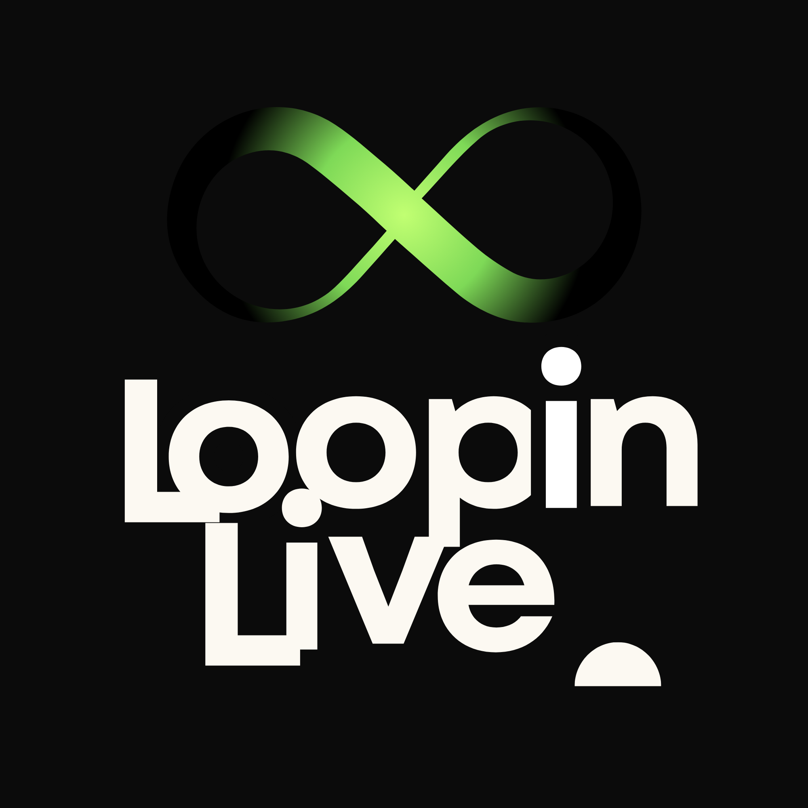

# LoopinLive - Watch Live TV Channels

<p align="center">
  
</p>

A modern, high-performance, and premium web-based LoopinLive player built with **Next.js 16**, **React 19**, and **Tailwind CSS v4**. Stream high-quality live TV channels directly from official broadcast sources with a cinematic user interface.

**LoopinLive**: https://LoopinLiveTV.netlify.app

---

## ✨ Features

- 📺 **Cinematic Video Player**: Large, center-aligned, aspect-ratio locked media container utilizing HLS.js and native iOS Safari player engines. Supports Picture-in-Picture (PiP), custom volume controls, double-tap seek, and auto-fallback muted play.
- 🌌 **3D CSS Net Background**: A highly optimized, static 3D perspective cyber grid with deep purple and cyan radial glows and a subtle viewport mesh overlay, designed for maximum performance (0% CPU/GPU overhead) on all devices.
- 🔍 **Interactive Channel Grid**: Filter and search through thousands of Bangla and international live TV channels in real-time. Responsive grid display dynamically adjusts for mobile, tablet, and desktop viewports.
- ⚡ **Full Skeleton UI Loading States**: Fully unified, custom-designed pulsing skeleton templates for every card element (Player, Details, Developer Info, Total Channels, and Channel List grid) to prevent layout shifts.
- 🧭 **Glassmorphic Sticky Header**: A clean, luxurious sticky header with brand identification and active live broadcast pulsing status.
- 🏆 **World Cup 2026 Announcement Popup**: A gorgeous, highly professional popup showcasing the official joint broadcasting rights (BTV, T Sports, Somoy TV) live in Bangladesh with custom high-contrast logo backdrops and ambient glowing animations.

---

## 🌍 Live TV Channels Database

If you want to use the curated, lightweight IPTV channel database (containing 6800+ channels) in another project, media player, or Android TV, you can fetch the raw files directly:

- **JSON Format**:
  ```
  https://raw.githubusercontent.com/thewiztanvir/LoopinLive/refs/heads/main/app/data/channels.json
  ```

- **M3U Playlist Format** (For Android TV, VLC, Kodi, or LoopinLive):
  ```
 https://raw.githubusercontent.com/thewiztanvir/LoopinLive/refs/heads/main/app/data/channels.m3u
  ```

> [!IMPORTANT]
> **License & Credit Notice**: If you use this channel database or stream source list in your own projects, you **must share and display proper credit** to the original developer (**S. SHAJON**) along with a link back to this repository.

---

## 🛠️ M3U Playlist Converter

If you need the channel database in standard M3U format, you can use the built-in Node.js conversion script.

### Usage

1. **Quick Conversion** (using defaults: all JSON files in `app/data` ➔ corresponding `.m3u` files):
   ```bash
   npm run convert-m3u
   ```
   *Or run it directly:*
   ```bash
   node scripts/json-to-m3u.js
   ```

2. **Custom Paths**:
   If you want to convert a specific JSON database only:
   ```bash
   node scripts/json-to-m3u.js <path-to-input.json> <path-to-output.m3u>
   ```

---

## 🛠️ Technology Stack

- **Framework**: [Next.js 16 (App Router)](https://nextjs.org/)
- **Library**: [React 19](https://react.dev/)
- **Styling**: [Tailwind CSS v4](https://tailwindcss.com/)
- **Animations**: [Motion](https://motion.dev/) (formerly Framer Motion)
- **Stream Engine**: [HLS.js](https://github.com/video-dev/hls.js/)

---

## 🚀 Getting Started

### Prerequisites

Ensure you have **Node.js** (v18.x or newer) installed.

### Installation

1. Clone this repository:
   ```bash
   git clone https://github.com/thewiztanvir/LoopinLive.git
   cd iptv
   ```

2. Install the dependencies:
   ```bash
   npm install
   ```

3. Run the development server:
   ```bash
   npm run dev
   ```

4. Open [http://localhost:3000](http://localhost:3000) in your browser to view the application.

### Production Build

To build the application for production:
```bash
npm run build
npm start
```

---

## ⚠️ Disclaimer

This repository does not host, store, retransmit, or own any television channels or media content. The JSON file and web player only reference publicly available stream links collected from open-source IPTV playlists and public internet sources. Channel availability may change, expire, or stop working at any time.

If you are the copyright owner of any content and would like it removed, please open an issue or contact the developer.

---

## ❤️ Credits

Special thanks to all IPTV open-source repository maintainers and contributors whose publicly available playlists and stream sources make this collection and player possible.

---

## 📄 License & Compliance

This project is open-source software licensed under the **GNU General Public License v3 (GPLv3)**.

### Open Source Compliance Guidelines:
1. **Copyleft Protection & Mandatory Open Source**: You are free to use, modify, and build upon everything in this repository, but any derivative player, application, or database **MUST remain fully open-source** and distributed under the same GPLv3 license.
2. **Preserve Developer Attribution**: You must preserve all S. SHAJON copyright, developer profile links (GitHub, Telegram, Facebook), and licensing labels in both the user interface and code files.
3. **No Commercial Ads or Betting/Gambling Promotions**: If you build your own IPTV player or service based on this codebase, database, or resources, you are **strictly prohibited** from integrating or displaying any form of commercial advertisements, pop-up ads, redirect ads, or betting/gambling promotions of any kind.

Developed with ♥ by [Mitab Sany](mailto:mitabsany@gmail.com). Follow [GitHub Profile](https://github.com/thewiztanvir) for updates.
